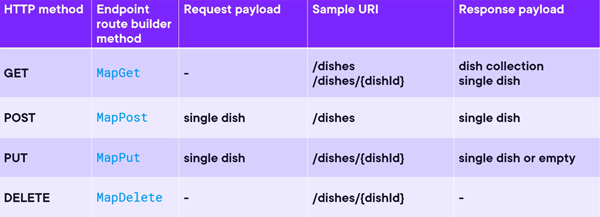
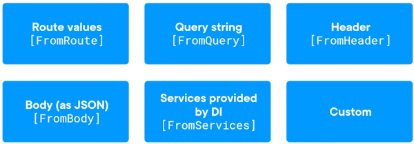

 If a full blown MVC controller is overkill you might consider a "Minimal API" instead.  


 ---

 #### Dependency Injection

 Instead of the standard MVC pattern of using fields and a constructor, with minimal APIs you can just pass dependencies in the handler signature to the route declaration as so:

 ```
 app.MapGet("/dishes", (DishesDbContext dishesDbContext) =>
{
    return dishesDbContext.Dishes;
});
```

Or to make it asynchronous:

```
app.MapGet("/dishes", async (DishesDbContext dishesDbContext) =>
{
    return await dishesDbContext.Dishes.ToListAsync();
});
```

---

#### Routing 

> The process of matching an HTTP method & URI to a specific route handler

An endpoint route builder exists for each HTTP verb:



Parts of the URI surrounded by `{}` are parameters, and can be accessed by including the handler signature as so:

```
// URI:
// https:/localhost:7070/dishes/dab23b28-df91-47e1-948e-76bf3e0c1546

// Route pattern + handler
app.MapGet( "dishes/{dishId}", () => (Guid dishId) => { ... });
```

---

#### Parameter Binding

In some cases you can just include `string nameOfParamHere` in the arguments, then access them in the body of the method, or to be more verbose you can use explicit binding to state where you expect the data to come from:



For example:
```
app.MapGet("/dishes/{dishName}", async (DishesDbContext dishesDbContext, IMapper mapper, [FromQuery] string dishName) =>
{
    return mapper.Map<DishDto>(await dishesDbContext.Dishes.FirstOrDefaultAsync(x => x.Name == dishName));
});
```

Would return the first dish containing the letter 'e' when visiting `address/dishes?name=e`

---

#### Status codes

Instead of just using `return` then your object, you should the appropriate code.  This could be `return TypedResults.Ok(foundThing);` or for a 404 `return TypedResults.NotFound();`

You can improve the compilers ability to enforce this by specifying it in the route too.  If there are multiple statuses that can be returned separate them with a comma.
```
app.MapGet("/dishes/{dishId:guid}", async Task<Results<NotFound, Ok<DishDto>>> (DishesDbContext dishesDbContext, IMapper mapper, Guid dishId) =>
{
    var dishEntity = await dishesDbContext.Dishes.FirstOrDefaultAsync(x => x.Id == dishId);

    if (dishEntity == null) return TypedResults.NotFound();
    
    return TypedResults.Ok(mapper.Map<DishDto>(dishEntity));
});
```