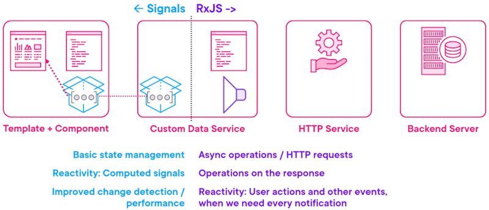

`.toSignal(observableName$)` will create a readonly signal that automatically sub/unsubs.  Optional 2nd parameter defines an initial value:
`products = toSignal(this.products$, { initialValue: [] as Product[]});`

`toObservable` makes a signal observable, but unlike subjects it won't emit every single value - it waits until all commands to emit.

For error handling use `catchError` in the observer pipe, or a try/catch block in a computed signal.  Use a generic interface like
```
export interface Result<T> {
  data: T | undefined;
  error?: string;
}
```
to capture and share the data and/or error.