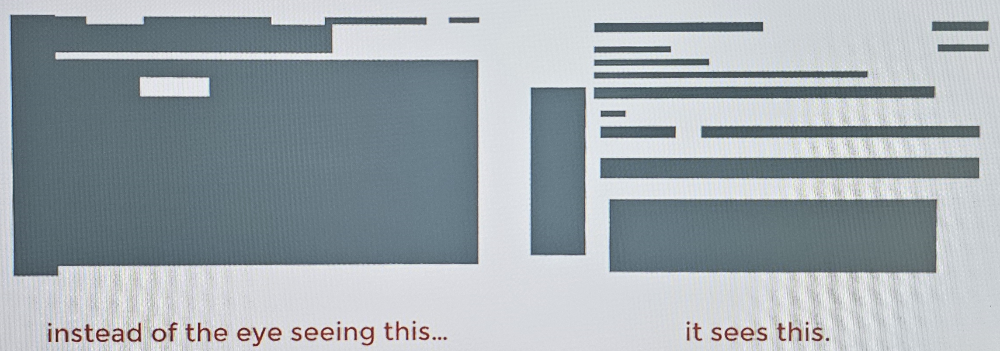

Imagine your site not as it truly appears, but as gray boxes of the content.  This can help to visualise separation, grouping, alignment, all kinds of things you won't see if you just look at it like a regular page.

