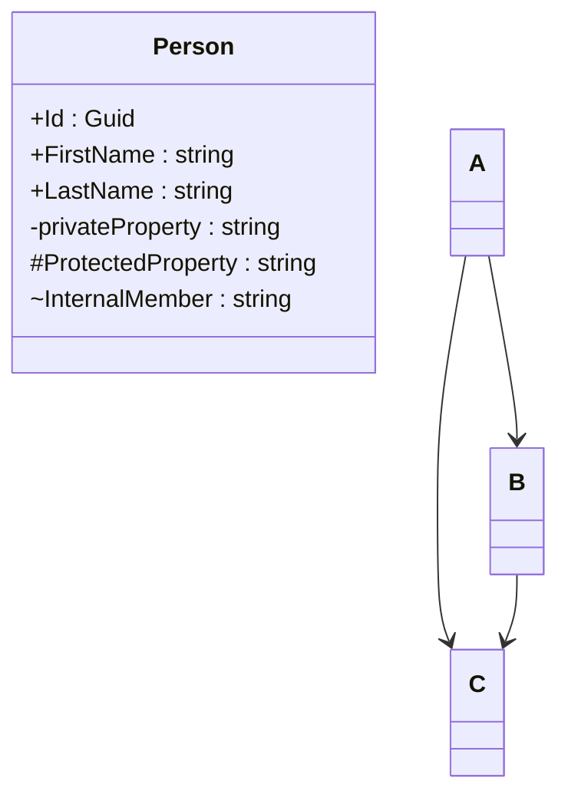

- Learn more markup with `mermaid`



For a flowchart: 
```
graph LR
    A-->B
```

For a class diagram:
```
classDiagram
    class Person {
        +Id : Guid
        +FirstName : string
    }

```

#### Convention for specifying visibility in class designs:

`+` Public members
`-` Private members
`#` Protected members
`~` Internal members
