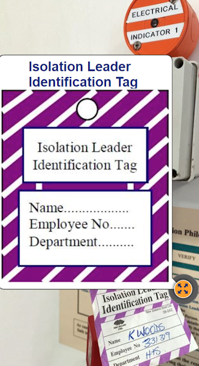
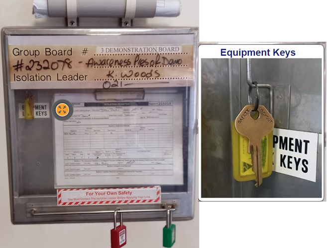

## Types of Isolation:

#### Simple Isolation

- Secures a maximum of **three** isolation points.
- Each person must personally secure the isolation point.

Example of an Isolation Leader ID Tag:

---

#### Group Isolation

- Secures many isolation points, locking equipment lock keys in group board.

- The isolation leader controls the group lock key

- Each person must secure the isolation point, locking the group board with personal lock

