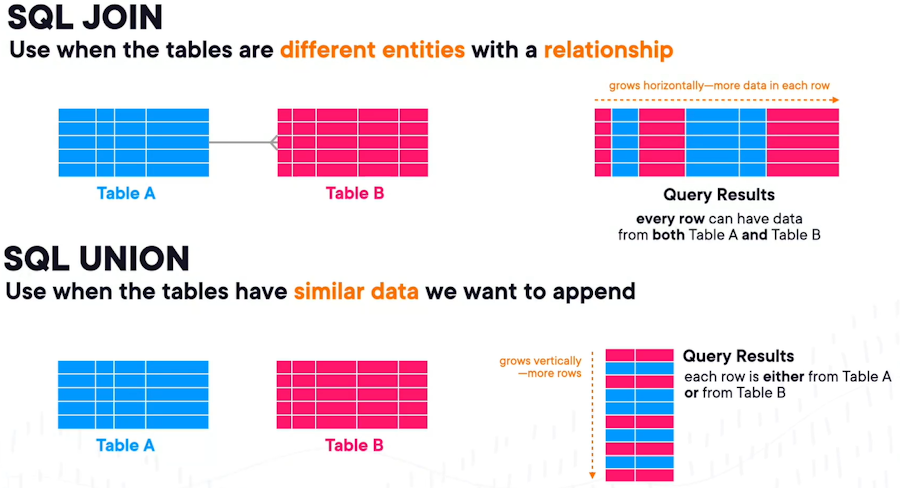

#### Subqueries

You can add queries in parentheses to be evaluated before the surrounding query runs.  For example, to find all items above the average price in a table:
```
SELECT ProductName, ListPrice
FROM Product
WHERE ListPrice > (SELECT AVG(ListPrice) FROM Product);
```

---

#### Unions

Unions can combine results from multiple tables into one row (including more than 1 column as long as the types match).  The column/s will be named after the first SELECTed tables columns.  `UNION` will remove all duplicate values by default, though this can have a slight impact on performance.  If you are confident there are no duplicates (or if you dont care, or want them) then instead `UNION ALL` will return all the data.  Use as follows:

```
SELECT column1, column2, column3
FROM table1
UNION
SELECT column1, column2, column3
FROM table2
UNION
SELECT column1, column2, column3
FROM table3;
```

**Union or Join?**

Joins are used when you different entities with a relationship and want to combine the data, unions are when the tables have similar data you want to append.

